# 🍕 Pizza Palace

![Pizza Palace]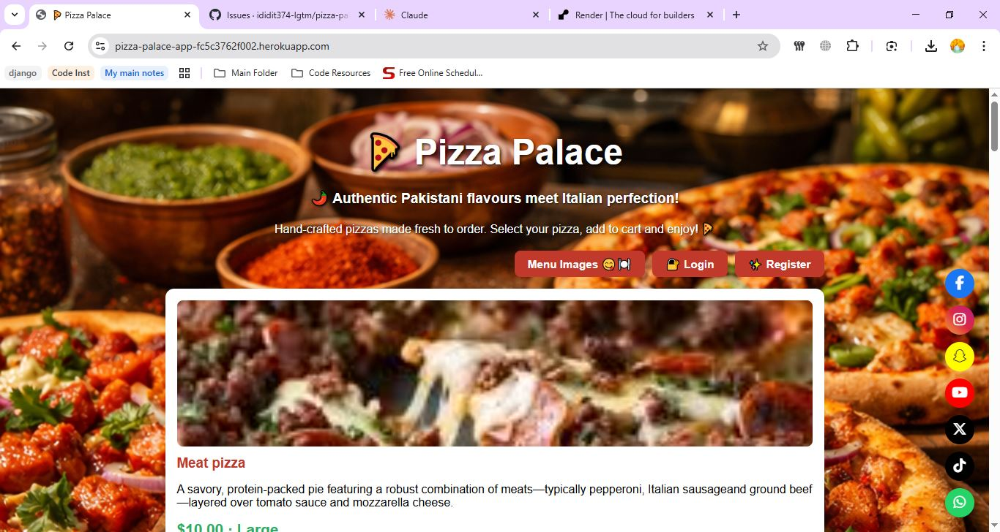

                         PIZZA PALACE! Inspired by amazing coders who deserve a treat after Vscoding:
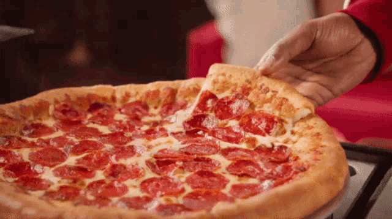

Pizza Palace is a full-stack Django web application for ordering authentic Pakistani-inspired pizzas online. Users can browse the menu, add items to a shopping cart, complete a mock-up payment, and receive an order confirmation upon purchase. Built with Django 6, PostgreSQL (Neon), and deployed on Heroku.
This project was developed with the support of AI tools for certain technical implementations that were beyond my current knowledge level — particularly around authentication, payment logic, and bug fixes. However, all architectural decisions were directed by me, the Django models and database relationships were written and managed by me, and all features were manually reviewed, tested, and understood before deployment. I followed Django terminal commands from the Code Institute LMS throughout, and where the walkthrough was unclear, I independently researched solutions — including how to create views, run commands, install packages, and resolve Heroku deployment errors.
I was particularly careful with database security — ensuring an .env file and .gitignore were in place before any GitHub deployment to protect secret keys. Once the application was running and the model relationships were established, I logged into the Django admin interface as a superuser to populate the menu with text, images, prices, and descriptions across pizzas, drinks, sides, and desserts. The emoji-style buttons throughout the site were also a personal design choice to give the app a fun, welcoming feel.

Below here was the infomration I pre-planned before procedding with getting the website created: 
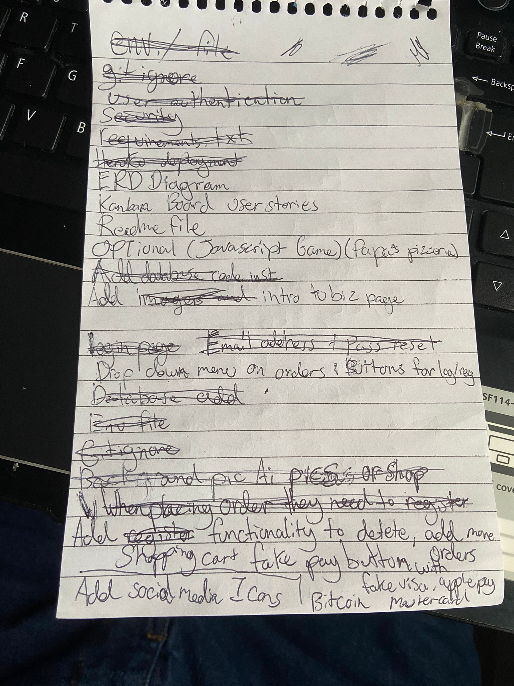

    

**Live Site:** [https://pizza-palace-app-fc5c3762f002.herokuapp.com/](https://pizza-palace-app-fc5c3762f002.herokuapp.com/)

---

## Table Of Contents:
1. [Design & Planning](#design--planning)
    * [User Stories](#user-stories)
    * [Wireframes](#wireframes)
    * [Agile Methodology](#agile-methodology)
    * [Typography](#typography)
    * [Colour Scheme](#colour-scheme)
    * [Database Diagram](#database-diagram)

2. [Features](#features)
    * [Navigation](#navigation)
    * [Footer](#footer)
    * [Home Page](#home-page)
    * [Gallery Page](#gallery-page)
    * [Cart & Checkout](#cart--checkout)
    * [Payment Page](#payment-page)
    * [Order Confirmation](#order-confirmation)
    * [CRUD](#crud)
    * [Authentication & Authorisation](#authentication--authorisation)

3. [Technologies Used](#technologies-used)
4. [Libraries Used](#libraries-used)
5. [Testing](#testing)
6. [Bugs](#bugs)
7. [Deployment](#deployment)
8. [AI](#ai)
9. [Credits](#credits)

---

## Design & Planning

### User Stories

User stories were written from three perspectives: the customer, the site owner, and the developer. They were tracked using a Kanban board (see [Agile Methodology](#agile-methodology) below).

#### Setup & Infrastructure

| ID | User Story | Priority | Status |
|---|---|---|---|
| #PP-01 | As a developer, I want a Django project set up with a menu app and SQLite database | High | ✅ Done |
| #PP-05 | As an admin, I want to manage pizzas and orders through the Django admin panel | Medium | ✅ Done |
| #PP-06 | As a developer, I want DEBUG set to False with ALLOWED_HOSTS configured for production | High | ✅ Done |

#### Authentication

| ID | User Story | Priority | Status |
|---|---|---|---|
| #PP-07 | As a user, I want to register an account so I can place orders securely | High | ✅ Done |
| #PP-08 | As a user, I want to log in with my email or username so I can access my account | High | ✅ Done |
| #PP-09 | As a user, I want to log out of my account so my session is secure | High | ✅ Done |
| #PP-10 | As a user, I want to reset my password via email if I forget it | High | ✅ Done |
| #PP-11 | As a user, I want password reset pages to match the Pizza Palace website design | Medium | ✅ Done |
| #PP-12 | As a user, I want to register with my email so I can reset my password later | Medium | ✅ Done |
| #PP-13 | As a user, I want a Remember Me option so I stay logged in between sessions | Medium | ✅ Done |

#### Menu & Ordering

| ID | User Story | Priority | Status |
|---|---|---|---|
| #PP-02 | As a user, I want to view a menu of available pizzas so I can choose what to order | High | ✅ Done |
| #PP-03 | As a user, I want to place an order by selecting pizzas and entering my details | High | ✅ Done |
| #PP-04 | As a user, I want to see an order confirmation page after placing my order | High | ✅ Done |
| #PP-17 | As a user, I want a shopping cart so I can add and remove pizzas before checkout | High | ✅ Done |
| #PP-18 | As a user, I want to see my cart total and a checkout button before placing my order | High | ✅ Done |
| #PP-19 | As a user, I want a fake payment page with card and Bitcoin options | High | ✅ Done |
| #PP-25 | As a developer, I want pizza items to display in a custom order so the menu looks organised | High | 🔄 In Progress |

#### UI & Design

| ID | User Story | Priority | Status |
|---|---|---|---|
| #PP-14 | As a user, I want pizza images to display on the menu so I can see what I'm ordering | Medium | ✅ Done |
| #PP-15 | As a user, I want a background image on the menu page so the site looks professional | Medium | ✅ Done |
| #PP-16 | As a user, I want pizza cards to display in a grid layout so the menu looks organised | Medium | ✅ Done |
| #PP-20 | As a user, I want to see Visa, Mastercard and Bitcoin icons so I know what payments are accepted | Medium | ✅ Done |
| #PP-21 | As a user, I want social media icons on the page so I can follow Pizza Palace online | Medium | ✅ Done |
| #PP-22 | As a user, I want a welcome intro message so I know what the website is about | Medium | ✅ Done |
| #PP-23 | As a user, I want a gallery page so I can browse all pizza images before ordering | Medium | ✅ Done |

#### Deployment

| ID | User Story | Priority | Status |
|---|---|---|---|
| #PP-24 | As a developer, I want the app deployed on Heroku with environment variables and Neon PostgreSQL | High | ✅ Done |

#### Future Features

| ID | User Story | Priority | Status |
|---|---|---|---|
| #PP-29 | As a user, I want to receive a real email confirmation after placing an order | Medium | 📋 To Do |
| #PP-30 | As an admin, I want to update order status so customers know when their pizza is being made | Low | 📋 To Do |
| #PP-31 | As a user, I want to see my past orders so I can reorder my favourites | Low | 📋 To Do |
| #PP-32 | As a user, I want to leave a review on a pizza I ordered | Low | 📋 To Do |

---

### Wireframes

The project was designed mobile-first. Key page layouts were planned before development:

- **Home / Menu Page** — Hero section with background image, welcome text, nav buttons and pizza cards in a grid
- **Cart Page** — List of selected items with quantity controls, subtotals and total price
- **Payment Page** — Order total, payment method selector (Card/Bitcoin) and card input fields
- **Login / Register Pages** — Simple centred card layout with form fields and links between pages

---

### Agile Methodology

This project was developed using an Agile approach. Work was broken down into user stories and tracked on a Kanban board with three columns: **To Do**, **In Progress**, and **Done**.

Labels were used to categorise stories: `Feature`, `Bug Fix`, `Auth`, `UI`, `Setup`, `Deploy`.

**Kanban Board Summary:**

| Column | Count |
|---|---|
| ✅ Done | 28 |
| 🔄 In Progress | 4 |
| 📋 To Do (Future) | 4 |
| **Total** | **32** |
| **Sprint Completion** | **87%** |

The GitHub Issues tab was used to track bugs and tasks alongside the board throughout development.

---

### Typography

The project uses **Arial** sans-serif throughout for maximum readability and fast load times:

- **Headings** — Bold Arial, red `#c0392b`
- **Body text** — Regular Arial, dark `#333`
- **Prices** — Bold green `#27ae60`
- **Buttons** — Bold white on red background

---

### Colour Scheme

| Colour | Hex | Usage |
|---|---|---|
| Pizza Red | `#c0392b` | Primary brand colour, buttons, headings |
| Dark Red | `#a93226` | Button hover states |
| Fresh Green | `#27ae60` | Prices, success messages, checkout button |
| Warm Cream | `#fff8f0` | Page background |
| White | `#ffffff` | Card backgrounds |
| Dark Text | `#333333` | Body text |

---

### Database Diagram

The application uses three main models:

```
Pizza                        Order
├── id (PK)                  ├── id (PK)
├── name                     ├── customer_name
├── description              ├── customer_email
├── price                    ├── status
├── size (S/M/L)             ├── created_at
├── image_url                └── total
├── is_available
└── sort_order               OrderItem (Junction)
                             ├── id (PK)
                             ├── order (FK → Order)
                             ├── pizza (FK → Pizza)
                             └── quantity
```

**Relationships:**
- One `Order` → many `OrderItem` records
- One `Pizza` → many `OrderItem` records
- `Order` and `Pizza` connected via `OrderItem` (Many-to-Many through model)

---

## Features

### Navigation

The nav bar adapts based on login state.

**Logged out:**


Shows: **Menu Images 😋🍽️**, **🔐 Login**, **✨ Register**

**Logged in:**

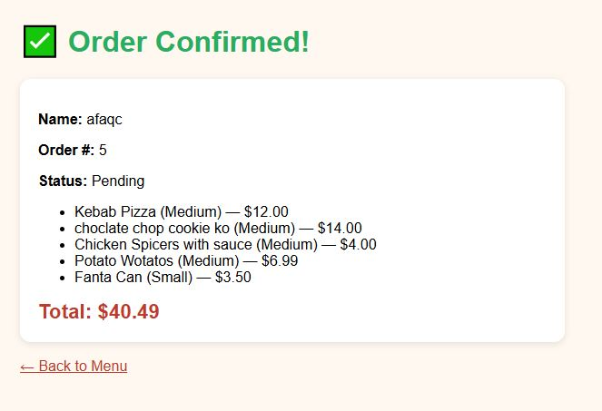

Shows: **Menu Images 😋🍽️**, **👤 Username**, **🛒 Cart (n)**, **Logout**

---

### Footer

**Accepted Payment Methods:**

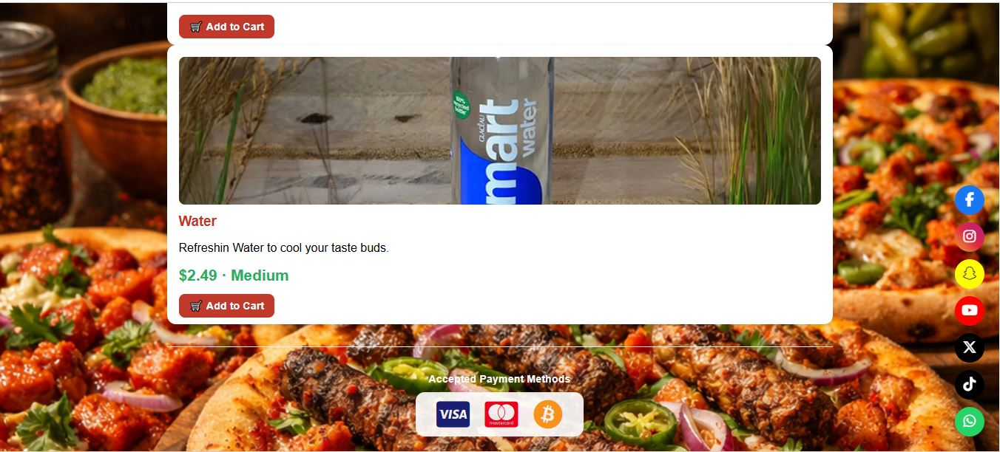

Visa, Mastercard and Bitcoin icons on a white pill background.

**Social Media Links:**

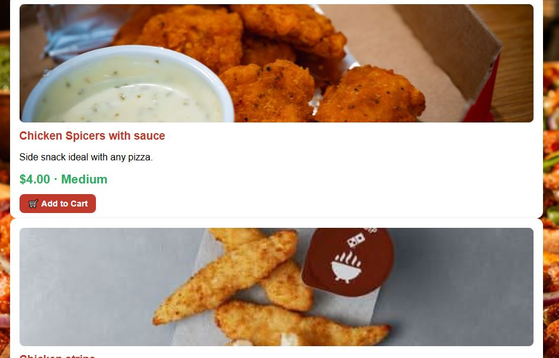

Fixed floating social buttons on the right side — Facebook, Instagram, Snapchat, YouTube, X, TikTok and WhatsApp. Each opens in a new tab.

---

### Home Page

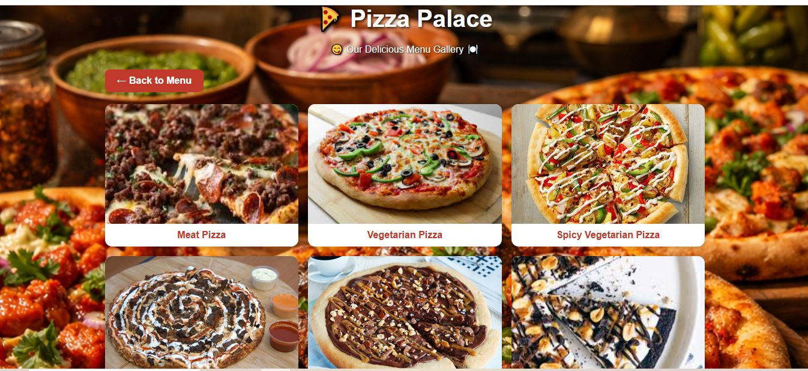

- Full-screen background image
- Pizza Palace logo and welcome intro
- Navigation bar
- Pizza cards with image, name, description, price, size and Add to Cart button

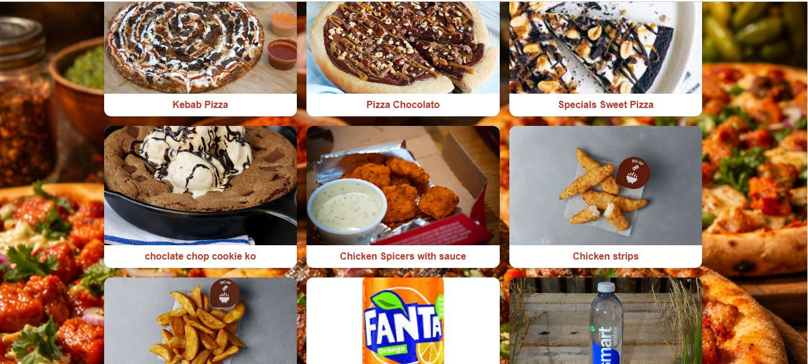

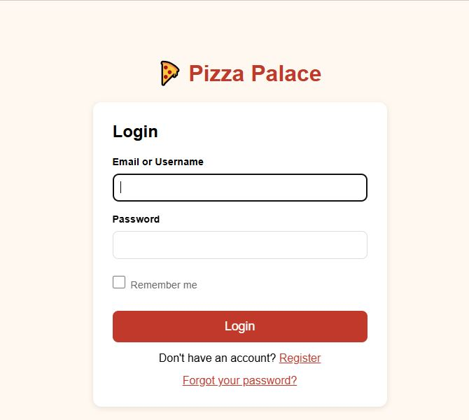

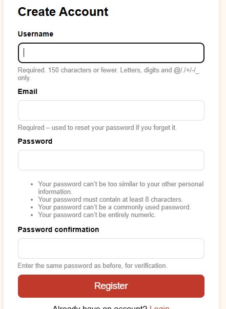

---

### Gallery Page

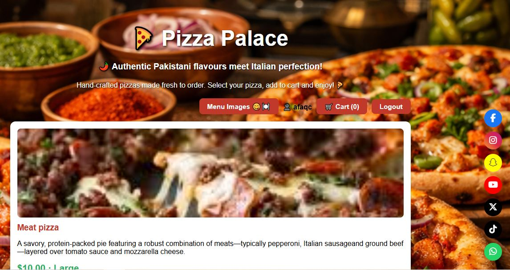

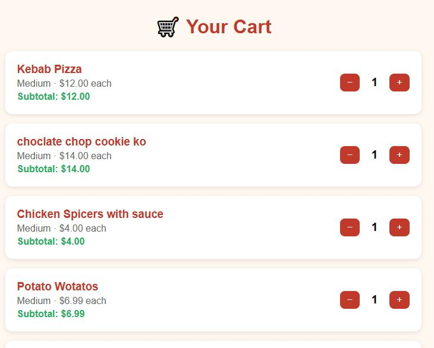

- 3-column responsive grid of all menu images
- Clicking any image opens a full-screen lightbox
- Back to Menu button

---

### Cart & Checkout

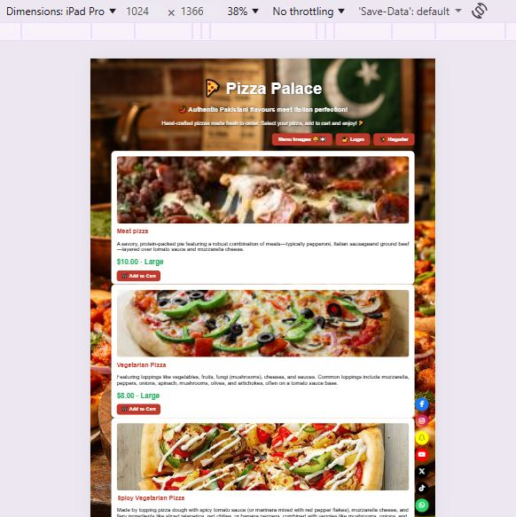

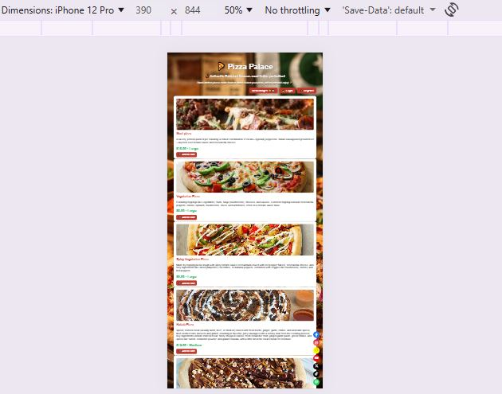

- Lists each item with name, size, price per item and subtotal
- **−** and **+** to adjust quantities
- Total price at the bottom
- Green **✅ Place Order** button to proceed to payment

---

### Payment Page

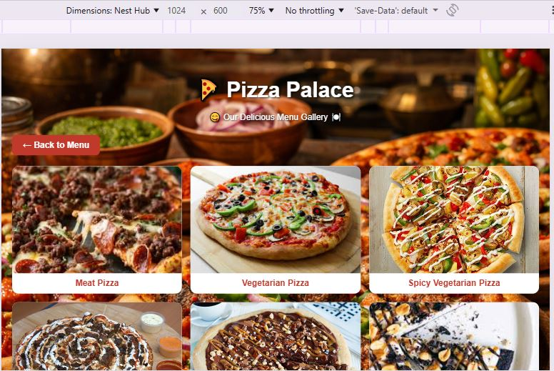

- Displays order total
- Two payment methods: **Visa/Mastercard** or **Bitcoin**
- Fields switch based on selected method
- Pre-filled dummy card details for testing
- **✅ Pay Now** processes the order

---

### Order Confirmation

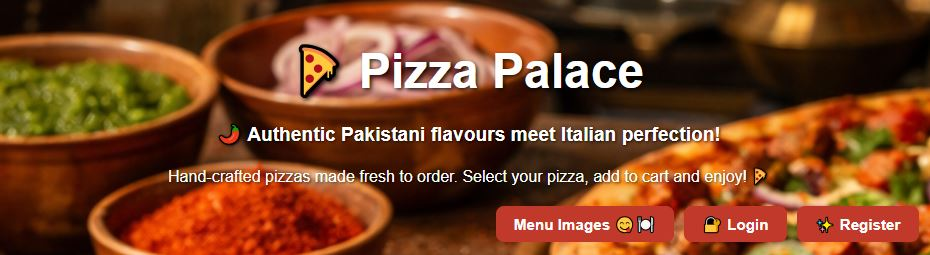

- ✅ Order Confirmed heading
- Customer name, order number, status
- Full itemised list with sizes and prices
- Order total
- Back to Menu link

---

### CRUD

| Operation | Where | Who |
|---|---|---|
| **Create** | Place order, register, add to cart | Customer |
| **Read** | View menu, cart, order confirmation | Customer |
| **Update** | Update cart quantities, order status | Customer / Admin |
| **Delete** | Remove cart items, delete orders/pizzas | Customer / Admin |

---

### Authentication & Authorisation

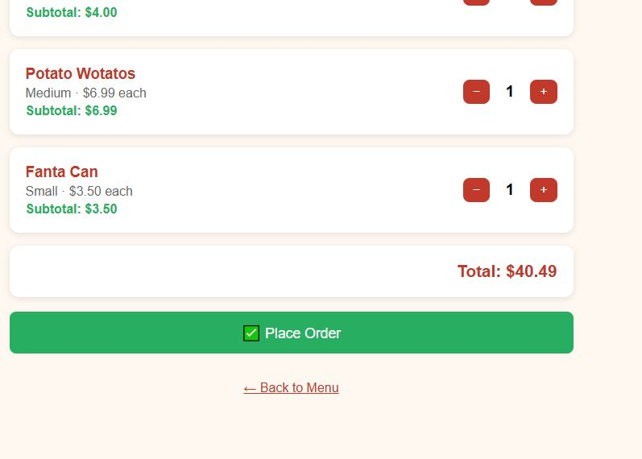

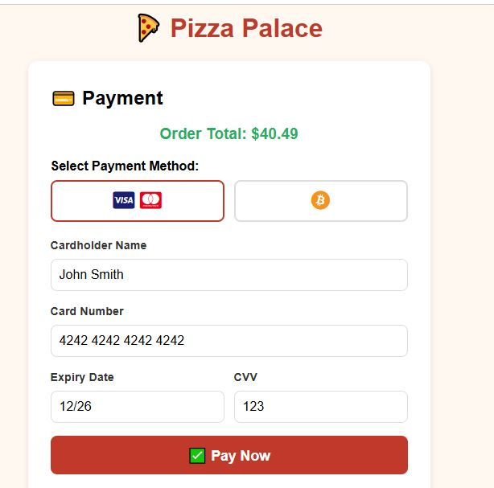

- **Register** — Username, email (required for password reset) and password
- **Login** — Email address **or** username accepted
- **Remember Me** — 2-week session if ticked; expires on browser close if not
- **Logout** — POST form to prevent CSRF issues (Django 6 requirement)
- **Password Reset** — Full email-based flow with custom-styled pages
- **Login Required** — Cart and checkout protected with `@login_required`
- **Custom Backend** — `menu/backends.py` allows login by email OR username

---

## Technologies Used

| Technology | Purpose |
|---|---|
| Django 6.0.3 | Backend web framework |
| Python 3.14 | Programming language |
| PostgreSQL (Neon) | Production cloud database |
| SQLite | Local development database |
| Heroku | Cloud deployment |
| GitHub | Version control |
| WhiteNoise | Static file serving in production |
| Gunicorn | WSGI HTTP server |
| Font Awesome 6 | Icons |
| HTML5 / CSS3 | Frontend markup and styling |
| JavaScript | Payment tab switching, lightbox |
| VSCode | Code editor |
| Git | Version control |

---

## Libraries Used

| Library | Version | Purpose |
|---|---|---|
| `django` | 6.0.3 | Core web framework |
| `psycopg2-binary` | 2.9.11 | PostgreSQL adapter |
| `dj-database-url` | 3.1.2 | Parse DATABASE_URL |
| `python-dotenv` | 1.2.2 | Load .env file locally |
| `whitenoise` | 6.12.0 | Serve static files |
| `gunicorn` | 22.0.0 | Production WSGI server |
| `pillow` | 12.1.1 | Image handling |

---

## Testing

### Google's Lighthouse Performance

Lighthouse was run on the live Heroku site from Chrome DevTools.

**Desktop — Home Page (Light Mode):**


| Category | Score |
|---|---|
| Performance | 60 🟠 |
| Accessibility | 39 🔴 |
| Best Practices | 54 🟠 |
| SEO | 82 🟠 |

**Desktop — Home Page (Dark Mode):**


| Category | Score |
|---|---|
| Performance | 54 🟠 |
| Accessibility | 39 🔴 |
| Best Practices | 77 🟠 |
| SEO | 82 🟠 |

> **Note:** Lighthouse flagged that Chrome extensions negatively affected the performance score. For more accurate results, run Lighthouse in incognito mode. The Accessibility score can be improved in future by adding `alt` attributes to all images and improving colour contrast ratios.

**Browser Tab — Favicon:**

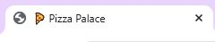

The Pizza Palace favicon (🍕 pizza slice emoji) displays correctly in the browser tab alongside the page title.

**Mobile — iPhone 12 Pro (390px):**


**Tablet — iPad Pro (1024px):**

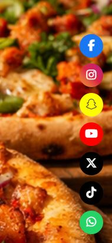

---

### Browser Compatibility

| Browser | Result |
|---|---|
| Google Chrome | ✅ Pass |
| Microsoft Edge | ✅ Pass |
| Mozilla Firefox | ✅ Pass |

---

### Responsiveness

Tested using Chrome DevTools across multiple device sizes. The site is responsive — on mobile the menu stacks to a single column, on tablet/desktop it displays in a grid.

---

### Code Validation

All code validated using:
- **HTML** — [W3C HTML Validator](https://validator.w3.org/)
- **CSS** — [W3C CSS Validator](https://jigsaw.w3.org/css-validator/)
- **Python** — [PEP8 CI Python Linter](https://pep8ci.herokuapp.com/) — all `.py` files checked

---

### Manual Testing — User Stories

| User Story | Test | Pass |
|---|---|:---:|
| Register an account | Go to /register/, fill form, click Register | ✅ |
| Log in with email or username | Go to /login/, enter email OR username + password | ✅ |
| Log out | Click Logout in nav bar | ✅ |
| Reset password | Click Forgot password, enter email, follow reset link | ✅ |
| View pizza menu | Navigate to home page, pizzas load with images and prices | ✅ |
| Add pizza to cart | Click Add to Cart, cart count increases | ✅ |
| Adjust cart quantities | Click + and − in cart, quantities update correctly | ✅ |
| View cart total | Navigate to /cart/, total shown at bottom | ✅ |
| Place an order | Click Place Order, fill payment details, click Pay Now | ✅ |
| View order confirmation | After payment, redirected to confirmation page | ✅ |
| View gallery | Click Menu Images button, gallery loads | ✅ |
| Lightbox on gallery | Click any gallery image, lightbox opens | ✅ |
| Admin manage pizzas | Log into /admin/, add/edit/delete pizza records | ✅ |
| Admin view orders | Log into /admin/, view all order records | ✅ |

---

### Manual Testing — Features

| Feature | Action | Status |
|:-------:|:--------|:--------|
| Nav logged out | Visit without login, see Login/Register buttons | ✅ |
| Nav logged in | Log in, see Cart and Logout buttons | ✅ |
| Cart count updates | Add item, cart button shows correct count | ✅ |
| Login redirect | Access /cart/ without login, redirected to /login/ | ✅ |
| Remember Me | Tick Remember Me, close browser, still logged in | ✅ |
| Social media links | Click each icon, opens correct site in new tab | ✅ |
| Payment method toggle | Click Bitcoin, card fields hide, Bitcoin field shows | ✅ |
| Gallery lightbox | Click image, fullscreen lightbox opens | ✅ |
| Background image | Background displays on menu and gallery pages | ✅ |

---

## Bugs

| Bug | Description | Fix |
|---|---|---|
| `DEBUG=False` 400 error | Setting DEBUG to False broke all requests | Added `ALLOWED_HOSTS` to settings.py |
| `/accounts/login/` showing Django admin login | Adding `accounts/` URLs overrode custom login | Overrode route in urls.py to point to custom view |
| Logout 405 error | Django 6 requires POST for logout | Replaced logout link with POST form |
| `TemplateDoesNotExist: registration/login.html` | Django's built-in auth looking for template | Removed `accounts/` URLs, set `LOGIN_URL = '/login/'` |
| Password reset showing admin interface | Using Django default templates | Created custom templates in `templates/registration/` |
| `collectstatic` failing | `STATIC_ROOT` not set | Added `STATIC_ROOT = BASE_DIR / 'staticfiles'` |
| `STORAGES` breaking collectstatic | Incompatible config | Replaced with `STATICFILES_STORAGE` setting |
| 500 error after deploying sort feature | `order` field clashed with reverse query name | Renamed to `sort_order` |
| Background image not showing | `max-width` on body constrained background | Moved background to full body, added `.page-wrapper` div |
| IndentationError in models.py | `class Meta` outside Pizza class | Fixed indentation |
| Cart `+` button redirecting to home | View always redirected to menu | Added `?next=/cart/` parameter |
| Heroku dyno limit for `createsuperuser` | Eco plan prevents extra dynos | Ran locally pointing to Neon DB via `.env` |

---

## Deployment

### Creating the Repository on GitHub

1. Sign into [GitHub](https://github.com/) and create a new repository named `pizza-palace`
2. Initialise Git locally:
```bash
git init
git add .
git commit -m "Initial commit"
git remote add origin https://github.com/YOUR_USERNAME/pizza-palace.git
git push -u origin master
```

### Creating an App on Heroku

1. Sign into [Heroku](https://www.heroku.com/)
2. Click **New** → **Create new app**
3. Name it (e.g. `pizza-palace-app`), select **Europe**, click **Create app**

### Create a Database

1. Sign up at [Neon](https://neon.tech/) (free tier)
2. Create a new project, choose **AWS EU Central 1 (Frankfurt)**
3. Copy the connection string
4. Add to `.env` file and Heroku Config Vars

### Environment Variables

`.env` file (same level as `manage.py`):
```
SECRET_KEY=your-secret-key
DATABASE_URL=postgresql://your-neon-connection-string
DEBUG=False
```

Heroku Config Vars (Settings → Reveal Config Vars):
- `SECRET_KEY`
- `DATABASE_URL`
- `DEBUG=False`

### Required Files

**`Procfile`** (no extension):
```
web: gunicorn pizzaapp.wsgi
```

**`requirements.txt`:**
```bash
pip freeze > requirements.txt
```

### Deploying to Heroku

1. Heroku dashboard → app → **Deploy** tab
2. Select **GitHub**, connect repository
3. Click **Deploy Branch**
4. Run migrations via Heroku console: `python manage.py migrate`

### Local Development

```bash
git clone https://github.com/ididit374-lgtm/pizza-palace.git
cd pizza-palace/pizzaapp
python -m venv .venv
.venv\Scripts\activate
pip install -r requirements.txt
python manage.py migrate
python manage.py createsuperuser
python manage.py runserver
```

---

## AI

AI tools were used throughout this project:

- **Claude.ai** — 
  - Writing and debugging views, URLs, forms
  - Setting up custom authentication (login, registration, password reset)
  - Creating the payment page with JavaScript tab switching
  - Social media icons and Font Awesome integration
  - Fixing all bugs documented above and reshape my readme template to a professionally documented one

- **ChatGPT / DALL-E** — Used to generate the background image

All AI-generated code was reviewed, understood and tested manually before deployment.

---

## Credits

- **Background image** — AI generated using ChatGPT/DALL-E
- **Pizza images** — Sourced from Google Images and Pinterest for demonstration purposes
- **Font Awesome** — [fontawesome.com](https://fontawesome.com/) — Icons
- **Heroku** — [heroku.com](https://heroku.com/) — Deployment
- **Neon** — [neon.tech](https://neon.tech/) — PostgreSQL database
- **WhiteNoise** — Static file serving
- **Django Documentation** — [docs.djangoproject.com](https://docs.djangoproject.com/)
- **Code Institute** — Learning resources and README template
- **Marko Tot** - For supporting me and giving me time to complete this project
- **Mark Briscoe** - For helping me fix errors on terminal to ensure django server runs correctly
- **Giovanni D'amico** - My good classmate who help me fixed my heroku deployment I was stuck for days at  

---

*Built with ❤️ and 🍕 by MohammadC*
